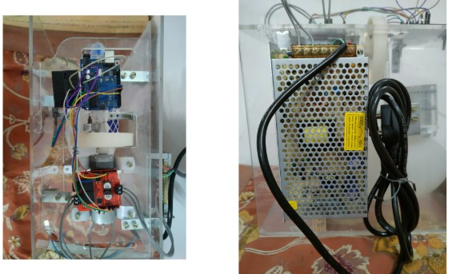
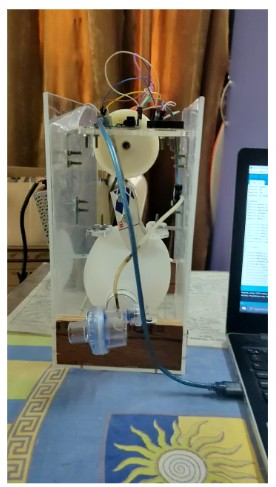

# 💨 UI for Low-Cost Electro-Mechanical Ventilator

[](#)
[](#)

An interactive, real-time UI dashboard for a low-cost ventilator using Arduino, React, and Node.js WebSocket server. Designed to support medical monitoring through waveform visualization of airway pressure and BPM.

---

## 🛠️ Features

- Real-time sensor data streaming from Arduino over serial
- WebSocket server pushing live updates to React frontend
- Chart.js-based waveform of airway pressure
- BPM mode display for Infant, Pre-schooler, Adult
- Optionally runs mock server for frontend testing

---

### 🎖️ IEEE YESIST12 2020 (WePOWER Track) – Honorable Mention  
Low-Cost Electro-Mechanical Ventilator presented at IEEE YESIST12 Finals.


### ⚙️ Hardware Prototype



### 💻 Demo Snapshot




---

## 🧰 Tech Stack

- **Frontend**: React + TypeScript + Vite + Chart.js
- **Backend**: Node.js + WebSocket
- **Microcontroller**: Arduino (ATmega328P)
- **Serial Communication**: serialport package

---

## 🚀 Getting Started

### 1. Clone this repository

```bash
git clone https://github.com/monikabhole001/UI-for-Low-Cost-Eletro-Mechanical-Ventilator.git
cd UI-for-Low-Cost-Eletro-Mechanical-Ventilator

